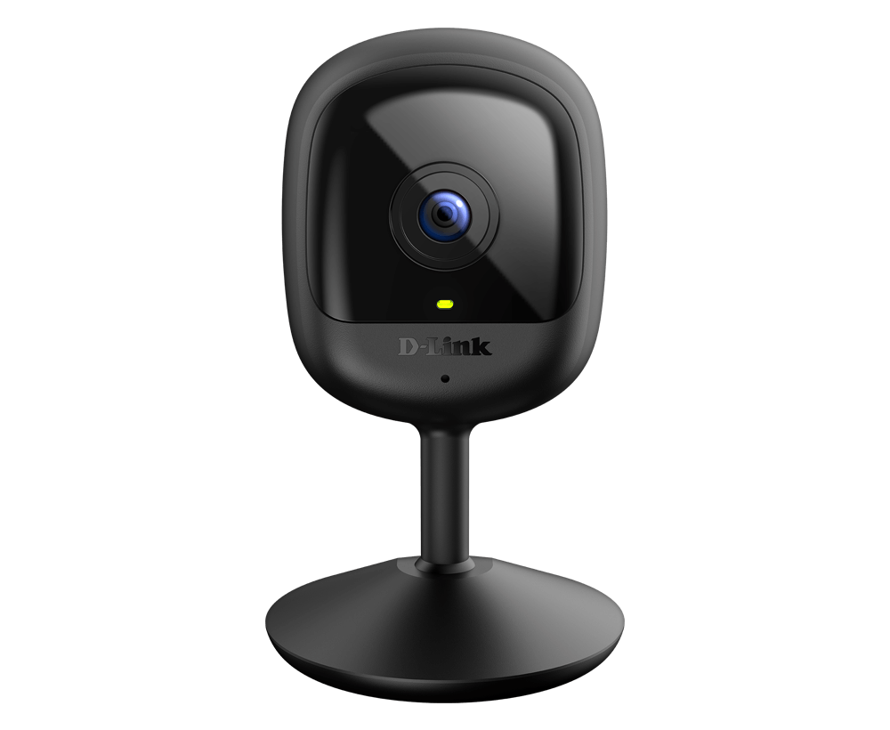

# Hacking the D-Link DCS-6100LH
<p align="center">
  
</p>

## Basic information

RTSP VLC Stream url:<br>
  rtsp://@192.168.0.20:554/live/profile.1/video<br>
  rtsp://@192.168.0.20:554/live/profile.0/video<br><br>
Inline credentials are deprecated. You will be prompted for a username and password:<br>
Username: admin<br>
Password: pincode from the bottom of your device<br><br>
The camera outputs 1920x1080@15fps<br><br>
Pincode can be recovered by flashing old firmware which has a bunch of debugging stuff left on. There seems to be no difference between the two URLs. The RTSP stream seems to work on all versions of the firmware[^4].

## Intro

The D-Link DCS-6100LH is a 2MP Wifi-only 5V IP Camera in a decent hardware package. <br>

Despite D-Link support claims to the contrary [^5] these devices ship with a working rtsp stream. This stream has been confirmed to be available on all versions of the firmware, 1.01-1.04 as of writing[^4].

The RTSP stream url was recovered by downgrading to version 1.01 of the firmware which also provides much more verbose console output. The stream url does not match any other published URLs. Downgrading should also allow recovery of the device pin. Downgrading is possible without hardware modification. Console access is achieved via RX and TX pins on the board.

**As always: messing around with the firmware of these things risks irreparably bricking them. You do so at your own risk. I can't help if things go wrong.**

## How to enter setup mode
In order to use the mydlink-app to setup the device it needs to be in setup mode.
Setup mode is indicate by the LED flashing orange (not red).
Setup mode can be acheived by, while the device is powered on, pressing the reset button for about one second.
After some time the LED should start flashing orange. Be patient.

You must use the mydlink-app to connect the device to your wifi. However it seems that you can blacklist the mydlink domain or presumably block the device in your firewall and it will remain connected to your wifi[^6].
## Firmware downgrade

It is possible to boot the device into recovery mode and downgrade the firmware as of firmware version 1.04.05

Allow the device to boot and use a pin to hold down the reset button for around 10 seconds. 
The device will boot into firmware recovery mode indicate by that the LED is flashing red (not orange). 
It will expose itself as an access point with the name DCS-6100LH-XXXX, where XXXX is the last four characters of the units MAC. 
You can then connect to the camera's wifi access point using the password on the sticker on the base of the device (not the pin).

The onboard DHCP server will give you an IP resembling 192.168.0.40. You can access the recovery interface at http://192.168.0.20:80<br>

You can then upload a firmware file, which you can download from:<br>
  [DCS-6100LH A1 V1.00](https://pmdap.dlink.com.tw/PMD/GetAgileFile?itemNumber=FIR2000285&fileName=DCS6100LHAx_FW100B09.bin&fileSize=673988.0;1085472.0;)<br>
  [DCS-6100LH A1 V1.01](https://pmdap.dlink.com.tw/PMD/GetAgileFile?itemNumber=FIR2000413&fileName=DCS6100LHAx_FW101B09.bin&fileSize=1136672.0;677931.0;)<br>
  [DCS-6100LH A1 V1.02](https://pmdap.dlink.com.tw/PMD/GetAgileFile?itemNumber=FIR2100011&fileName=DCS6100LHAx_FW102B02.bin&fileSize=751930.0;1146912.0;)<br>
  [DCS-6100LH A1 V1.03](https://pmdap.dlink.com.tw/PMD/GetAgileFile?itemNumber=FIR2100137&fileName=DCS6100LHAx_FW103B03.bin&fileSize=1167392.0;756811.0;)<br>

If those links fail, then you can also find the firmware via their GPL portal, page 5 as of writing:<br>
	https://tsd.dlink.com.tw/downloads2008list.asp?t=1&Category=Product%20Data%20II%3EIP%20Surveillance%3EIP%20Cameras&pagetype=G

# Accessing & configuring the device via Serial/Telnet 

As of writing the device can be rooted without issue. See issue [#9](https://github.com/mouldybread/DCS-6100LH/issues/9) for pin locations.

## Obtaining root password
    "DCS-6100LH-MACADDRESS"

Replace MACADDRESS with the mac address for your camera (for example: "DCS-6100LH-B0C5546518E7")

The mac address can be found on the quick start guide or the underside of the camera.

Put that through a md5 hash generator and the first 8 characters of the hash should be the root password

<sub> With thanks to [DavidByggerBilar](https://github.com/DavidByggerBilar) and as noted in [#9](https://github.com/mouldybread/DCS-6100LH/issues/9)</sub>

## Disable OSD
Open SystemConfig.ini

Find the OSD section and set OsdDisplayEnable to 0

    OsdDisplayEnable = 0

This will disable the overlay

<sub> With thanks to [DavidByggerBilar](https://github.com/DavidByggerBilar) and as noted in [#9](https://github.com/mouldybread/DCS-6100LH/issues/9)</sub>

## Disable LED
Open SystemConfig.ini

Find The Mydlink Section

Set light_status to 0

    light_status = 0

<sub> With thanks to [DavidByggerBilar](https://github.com/DavidByggerBilar) and as noted in [#9](https://github.com/mouldybread/DCS-6100LH/issues/9)</sub>

## Enable telnet


Open /mnt/mtd/boot.sh

Comment out the following (near line 140):

    /etc/init.d/S50telnet stop

This will prevent the telnet daemon from being stopped

<sub> With thanks to [DavidByggerBilar](https://github.com/DavidByggerBilar) and as noted in [#9](https://github.com/mouldybread/DCS-6100LH/issues/9) </sub>

## Telnet & Busybox
The camera uses busybox, the syntax for the various commands can be found here: https://busybox.net/downloads/BusyBox.html

### Transferring files

    tftp -p -l SystemConfig.ini 192.168.xxx.xxx

The above command sends a file to a tftp server at address: 192.168.xxx.xxx

### Receiving files

     tftp -g -r test.txt 192.168.xxx.xxx

The above command gets a file from a tftp server at address: 192.168.xxx.xxx

<sub> With thanks to [DavidByggerBilar](https://github.com/DavidByggerBilar) and as noted in [#9](https://github.com/mouldybread/DCS-6100LH/issues/9)</sub>

## Disable cloud functions
     vi /mydlink/mydlink_watchdog.sh
+ press i, add exit under #!/bin/sh, press esc, type :wq and press enter
> [!NOTE]
> Needs to be checked, from looking at it in ghidra these are the cloud services - somehow the streamer still reported occasional connections from an Orange ASN, could be a bug or my network equipment

<sub> With thanks to [DSchndr](https://github.com/DSchndr) and as noted in [#8](https://github.com/mouldybread/DCS-6100LH/issues/8)</sub>

## Alternative root access 

+ connect uart (115200, near the usb port)

+ press a button to stop uboot from booting and then

```
    setenv bootargs console=ttyS1,9600 init=/bin/sh root=/dev/mtdblock3 rts-quadspi.channels=dual mtdparts=18030000.spic:16384k@0(global),320k@0k(boot),2304k@320k(kernel),3584k@2624k(rootfs),7744k@6208k(userdata),2048k@13952k(userdata2),384k@16000k(userdata3)
```
+ boot

+ change baud rate to 9600

+ passwd root 2x enter and you've opened pandoras box

+ reboot afterwards

+ enable telenet


<sub> With thanks to [DSchndr](https://github.com/DSchndr) and as noted in [#8](https://github.com/mouldybread/DCS-6100LH/issues/8) </sub>

## Configure wifi without app
Open
```
    vi /mnt/conf/SystemConfig.ini
```
Edit as follows
  ```
    WIFI_SECURITY_TYPE = 5 WIFI_SSID = [B64-Encoded] WIFI_PWD = [B64-Encoded] register_st = 1
  ```
Reboot

<sub> With thanks to [DSchndr](https://github.com/DSchndr) and as noted in [#8](https://github.com/mouldybread/DCS-6100LH/issues/8) </sub>

## RTSP Stream Login & Password
Stored in /mnt/conf/SystemConfig.ini

<sub> With thanks to [DSchndr](https://github.com/DSchndr) and as noted in [#8](https://github.com/mouldybread/DCS-6100LH/issues/8) </sub>


## Decrypting update package
+ Hold the reset button for 5 seconds, go to the firmware recovery page
+ Upload the firmware you want the keys for (they probably come from da_adaptor, seed is quite obvious in the header of the update file)
+ Seed, Key and IV plop out on the Serial port - decrypt with openssl aes-128-cbc -d -p -nopad -K "KEY" -iv "IV" -S "SEED" -in UPDATE.bin -out dec.bin 
+ Use binwalk to explore the package

<sub> With thanks to [DSchndr](https://github.com/DSchndr) and as noted in [#8](https://github.com/mouldybread/DCS-6100LH/issues/8) </sub>

## Misc notes & Information

### Hardware details
cat cpuinfo outputs the following:
```
    system type : Formosa
    machine : RTS3903N EVB
    processor : 0
    cpu model : Taroko V0.2 FPU V0.1
    BogoMIPS : 497.66
    wait instruction : no
    microsecond timers : yes
    tlb_entries : 64
    extra interrupt vector : no
    hardware watchpoint : no
    isa : mips1
    ASEs implemented : mips16
    shadow register sets : 1
    kscratch registers : 0
    package : 0
    core : 0
    VCED exceptions : not available
    VCEI exceptions : not available
```
cat version outputs the following:
```
    Linux version 4.9.51 (root@ubuntu) (gcc version 6.4.1 20180425 (Realtek RSDK-6.4.1 Build 3029) ) #78 Wed May 6 20:32:31 CST 2020
```

<sub> With thanks to [DavidByggerBilar](https://github.com/DavidByggerBilar) and as noted in [#9](https://github.com/mouldybread/DCS-6100LH/issues/9)</sub>
### Initial notes

As usual, onboarding the device was painful.~~It required full internet access to complete the process and a mydlink account.~~ My device wasn't new so it needed to be reset. 

The quickstart guide[^0] says: 
	"Reset and reinstall your device. Use a paperclip to press the recessed Reset button and the LED will turn solid red"

After onboarding I discovered the device wouldn't function without a working internet connection and also didn't expose anything to do with RTSP. Unless you are d-link. In Which case it happily streams RTSP offsite where they kindly allow us peons to stream it via their servers in an app or web browser. 

I initially attempted to gain root access via the hardware pins[^1]. 
	
Remove the single black screw below the micro-usb power port. Squeeze the sides of the device and work the back off. Remove the remaining three silver screws. The board can now be removed from its chassis.

There are three obvious, but very tiny through holes next to the usb port. The hole next to the usb port is ground. Middle pin is TX. End pin is RX. I removed and trimmed some metal prongs from a female pcb connector, and carefully soldered them into the through holes.

I couldn't log in as root using any of the available pins or passwords and the latest firmware gives a lot less output.

Next I tried to use the instructions from bmorks defogger[^2] to get a root console. This failed because it couldn't find /bin/sh or /bin/bash. I don't know enough about this stuff to push any further so on a whim I decided to see if I could find old versions of the firmware.

As luck would have it I did, direct from D-Link. Not only that but the recovery mode allowed me to downgrade the firmware. Earlier versions have much more verbose output from their RTSP server and I was eventually able to figure out a working stream URL.

I also observed onvif related output(!) on the console. Username was admin and pass was the pincode. So there's probably onvif running on this thing, somewhere. 

The Taiwanese D-Link support portal also links to versions of the firmware[^3]


[^0]: https://media.dlink.eu/support/products/dcs/dcs-6100lh/documentation/dcs-6100lh_qig_reva1_1-00_eu_multi_20201102.pdf
[^1]: https://github.com/wuseman/DLink_6100LH/
[^2]: https://github.com/bmork/defogger#u-boot
[^3]: https://www.dlinktw.com.tw/techsupport/ProductInfo.aspx?m=DCS-6100LH
[^4]: https://github.com/mouldybread/DCS-6100LH/issues/1
[^5]: https://community.home-assistant.io/t/anybody-hacked-adapted-d-link-dcs-6500lh/412703/6
[^6]: https://github.com/mouldybread/DCS-6100LH/issues/3
